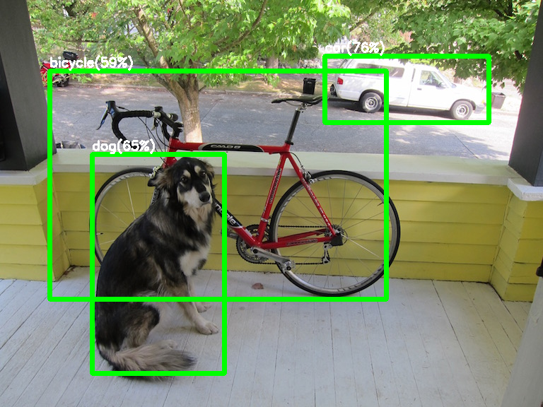

# YOLOv2 via Chainer to predict objects and apply its intel NCS

[Original README](./README_original.md)  

## Requirements

- python3 and pip3
- chainer 5.2.0( need at least 2.0.0 version )

## Environment for test

- ubuntu 16.04

## prepare
    $ pip3 install chainer==5.2.0
    
## Download and first move
    $ git clone *this_repo*
    $ cd *this_repo* directory
    $ cat model/yolo.weights_* > yolo.weights
    $ python3 yolov2_darknet_parser.py yolo.weights
    loading yolo.weights
    loading initial model...
    1 992
    2 19680
    3 93920
    4 102368
    5 176608
    6 472544
    7 505824
    8 801760
    9 1983456
    10 2115552
    11 3297248
    12 3429344
    13 4611040
    14 9333728
    15 9860064
    16 14582752
    17 15109088
    18 19831776
    19 29273056
    20 38714336
    21 67029984
    22 67465609
    save weights file to yolov2_darknet.model
    
    $ python3 yolov2_darknet_predict.py dog.jpg 
    loading image...
    loading coco model...
    orig_img.shape (576, 768, 3)
    reshaped to orig_img.shape (320, 448, 3)
    BGR2RGB
    img/255
    transepose img.shape (3, 320, 448)
    new axis .shape (1, 3, 320, 448)
    variable.shape (1, 3, 320, 448)
    call self.model.predict
    predicted x.shape (1, 5, 1, 10, 14)
    predicted y.shape (1, 5, 1, 10, 14)
    predicted w.shape (1, 5, 1, 10, 14)
    predicted h.shape (1, 5, 1, 10, 14)
    predicted conf.shape (1, 5, 1, 10, 14)
    predicted prob.shape (1, 5, 80, 10, 14)
    car(76%)
    dog(66%)
    bicycle(59%)
    save results to yolov2_result.jpg

### Notice to prevent UTF-8 coding
If using original repo instead of this repo, some python scripts in original repo are coded by UTF-8 to use japanese. It causes error of python runtime, so apply one of bellows.  

- Use Japanese Ubuntu
- Add *# encoding: utf-8* to top line of some python scripts(done)
- Use anaconda python

## Investigate output memory layout of Inference engine of chainer
**Flow of yolov2_darknet_predict.py and memory layout of in/out predictor.**  

    orig_img.shape (576, 768, 3)             # read "dog.jpg" image by opencv
    reshaped to orig_img.shape (320, 448, 3) # transform to optimal size
    BGR2RGB                                  # change BGR to RGB
    img/255                                  # normalize 0.0 to 1.0
    transepose img.shape (3, 320, 448)       # transform HWC to CHW
    new axis .shape (1, 3, 320, 448)         # transform CHW to NCHW
    variable.shape (1, 3, 320, 448)          # create chainer varable
    predicted x.shape (1, 5, 1, 10, 14)      # X
    predicted y.shape (1, 5, 1, 10, 14)      # Y
    predicted w.shape (1, 5, 1, 10, 14)      # W
    predicted h.shape (1, 5, 1, 10, 14)      # H
    predicted conf.shape (1, 5, 1, 10, 14)   # Confidence
    predicted prob.shape (1, 5, 80, 10, 14)  # Class probabilities

### Transforming original image size to optimal size
Input image size of YOLO network will be transformed to optimal size divided by 32. 32 is downsampling ratio of YOLO(1/2^5).  

# Swaping inference engine from chainer to OpenVINO

## Try to transform from chainer to other formats supported by OpenVINO

Notice: Transformation from Darknet weights and cfg to tensorflow pb is out of scope of this repo.  

### to caffemodel

If using Bias layer, "BroadcastTo not found" error occurres.  If avoiding Bias layer error, "Transpose not found" error occurres.  
I gave up using chainer.exporters.caffe exportation.  

    Exception: Cannot convert, name=BroadcastTo-1-1, rank=1,
    label=BroadcastTo, inputs=['Reshape-0-1']
    
    or
    
    Exception: Cannot convert, name=Transpose-44-1, rank=44,
    label=Transpose, inputs=['Reshape-43-1']

### to onnx

install onnx-chainer  

    $ pip3 install onnx-chainer
    ...
    Collecting chainer>=3.2.0 (from onnx-chainer)
    Collecting onnx>=1.3.0 (from onnx-chainer)
    ...
    
    $ python3 export.py
    ...
    onnx_op_name, opset_versions = mapping.operators[func_name]
    KeyError: 'BroadcastTo'

onnx_chainer "BroadcastTo not found" error.  

## Limitations to convert chainer network definition to onnx or caffemodel  

- **L.Bias causes KeyError: 'BroadcastTo'. So do not use L.Bias layer.**
- **use_beta option of L.BatchNormalize() must be True. So do not use use_beta=False**
- **Rewrite Network definition to keep 2 terms of above.**

## Modify chainer model definition to avoid onnx-chainer troubles

Let you see modified version ./yolov2.py.  
And confirm the differences btn ./yolov2.py and ./yolov2_orig.py.  
Using ./yolov2.py as sample, you can continue bellow sections.  

## Generate npz model file corresponding to ./yolov2.py from npz correspoding to ./yolov2_orig.py 

    $ python3 npz2npz4custom_load.py yolov2_darknet.model yolov2_darknetNoBias.npz
    $ ls *.npz
    yolov2_darknetNoBias.npz
    
## Export onnx model via onnx-chainer

    $ python3 export.py
    $ ls *.onnx
    yolov2_darknetNoBias.onnx

Here, yolov2_darknetNoBias.onnx.txt include TextDump of onnx model file to confirm and check contents.  

## Generate IRmodel from onnx model file

    $ mo_onnx.py --input_model yolov2_darknetNoBias.onnx --output_dir FP32 --data_type FP32
    $ mo_onnx.py --input_model yolov2_darknetNoBias.onnx --output_dir FP16 --data_type FP16
    $ ls FP32 FP16
    FP16:
    yolov2_darknetNoBias.bin  yolov2_darknetNoBias.mapping  yolov2_darknetNoBias.xml
    FP32:
    yolov2_darknetNoBias.bin  yolov2_darknetNoBias.mapping  yolov2_darknetNoBias.xml

## Check quickly IRmodel file

**IRmodel FP32@CPU check is normally ended good.**  

    $ python3 IEbase.py --bin FP32/yolov2_darknetNoBias.bin --xml FP32/yolov2_darknetNoBias.xml -d CPU
    * IEsetup FP32/yolov2_darknetNoBias.bin on CPU
    network in shape n/c/h/w (from xml)= 1 3 416 416
    input_blob = Input_0
      net.outputs[ Conv_21 ].shape [1, 425, 13, 13]
    * IEsetup done 1338.87msec

IRmodel FP16@MYRIAD check is abnormally ended.  

    $ python3 IEbase.py --bin FP16/yolov2_darknetNoBias.bin --xml FP16/yolov2_darknetNoBias.xml -d MYRIAD
    * IEsetup FP16/yolov2_darknetNoBias.bin on MYRIAD
    Traceback (most recent call last):
      File "IEbase.py", line 73, in <module>
        exec_net, plugin, input_blob, out_blobs = IEsetup(args.xml, args.bin, args.device, verbose=True)
      File "IEbase.py", line 19, in IEsetup
        exec_net = plugin.load(network=net, num_requests=1)
      File "ie_api.pyx", line 389, in openvino.inference_engine.ie_api.IEPlugin.load
      File "ie_api.pyx", line 400, in openvino.inference_engine.ie_api.IEPlugin.load
    RuntimeError: AssertionFailed: newDims[newPerm[i]] == 1

**I can not find "ie_api.pyx" source code everywhere.**
Myabe it is in dynamic link library "ie_api.so" file.  

I gave up porting to FP16.  

## Run demo script to infer objects on images with yolov2

    $ python3 demo_img_yolov2NoBias.py -i ./data/*.jpg

